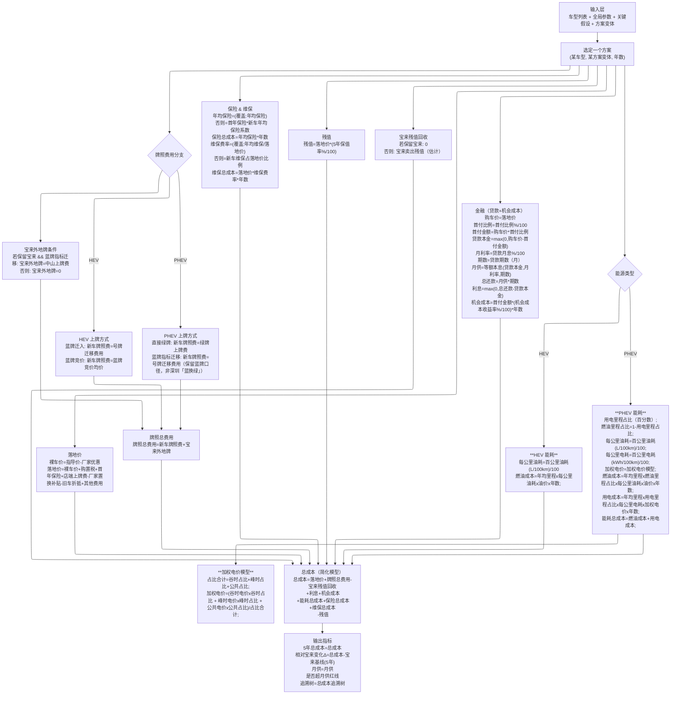

中间变量与公式

**口径摘要**：5 年**总成本** = **购车成本（不含贷款利息）** + **贷款利息**；购车成本中含落地价、牌照货币费用、机会成本、能耗、保险、维保，并扣减残值与（若淘汰宝来）宝来残值回收。**不计入**上牌等待、办理耗时等摩擦货币化。详见 [DESIGN.md](./DESIGN.md) 计算模型小节。

```mermaid
---
config:
  layout: elk
---
flowchart TD
  inputLayer["输入层<br/>车型列表 + 全局参数 + 关键假设 + 方案变体"] --> plan["选定一个方案<br/>(某车型, 某方案变体, 年数)"]
  plan --> landing["落地价<br/>裸车价=指导价-厂家优惠<br/>落地价=裸车价+购置税+首年保险+店端上牌费-厂家置换补贴-旧车折抵+其他费用"]

  plan --> plateBranch{牌照费用分支}
  plateBranch -->|HEV| plateHEV["HEV 上牌方式<br/>蓝牌迁入: 新车牌照费=号牌迁移费用<br/>蓝牌竞价: 新车牌照费=蓝牌竞价均价"]
  plateBranch -->|PHEV| platePHEV["PHEV 上牌方式<br/>直接绿牌: 新车牌照费=绿牌上牌费<br/>蓝牌指标迁移: 新车牌照费=号牌迁移费用（保留蓝牌口径，非深圳「蓝换绿」）"]
  plateBranch --> plateBaoLaiExtra["宝来外地牌条件<br/>若保留宝来 && 蓝牌指标迁移: 宝来外地牌=中山上牌费<br/>否则: 宝来外地牌=0"]
  plateHEV --> plateTotal["牌照总费用<br/>牌照总费用=新车牌照费+宝来外地牌"]
  platePHEV --> plateTotal
  plateBaoLaiExtra --> plateTotal

  plan --> finance["金融（贷款+机会成本）<br/>购车价=落地价<br/>首付比例=首付比例%/100<br/>首付金额=购车价*首付比例<br/>贷款本金=max(0,购车价-首付金额)<br/>月利率=贷款月息%/100<br/>期数=贷款期数（月）<br/>月供=等额本息(贷款本金,月利率,期数)<br/>总还款=月供*期数<br/>利息=max(0,总还款-贷款本金)<br/>机会成本=首付金额*(机会成本收益率%/100)*年数"]

  plan --> energyBranch{能源类型}
  energyBranch -->|HEV| hev["**HEV 能耗**<br/>每公里油耗=百公里油耗(L/100km)/100<br/>燃油成本=年均里程x每公里油耗x油价x年数;"]
  energyBranch -->|PHEV| phev["**PHEV 能耗**<br/>用电里程占比（百分数）;<br/>燃油里程占比=1-用电里程占比;<br/>每公里油耗=百公里油耗(L/100km)/100;<br/>每公里电耗=百公里电耗(kWh/100km)/100;<br/>加权电价=加权电价模型;<br/>燃油成本=年均里程x燃油里程占比x每公里油耗x油价x年数;<br/>用电成本=年均里程x用电里程占比x每公里电耗x加权电价x年数;<br/>能耗总成本=燃油成本+用电成本;"]

  phev --> elecPrice["**加权电价模型**<br/>占比合计=谷时占比+峰时占比+公共占比;<br/>加权电价=(谷时电价x谷时占比 + 峰时电价x峰时占比 + 公共电价x公共占比)/占比合计;"]

  plan --> insMaint["保险 & 维保<br/>年均保险=(覆盖:年均保险)<br/>  否则=首年保险*新车年均保险系数<br/>保险总成本=年均保险*年数<br/>维保费率=(覆盖:年均维保/落地价)<br/>  否则=新车维保占落地价比例<br/>维保总成本=落地价*维保费率*年数"]

  plan --> residual["残值<br/>残值=落地价*(5年保值率%/100)"]

  plan --> baolaiRecovery["宝来残值回收<br/>若保留宝来: 0<br/>否则: 宝来卖出残值（估计）"]

  landing --> total["总成本（简化模型）<br/>总成本=落地价+牌照总费用-宝来残值回收<br/> +利息+机会成本<br/> +能耗总成本+保险总成本+维保总成本<br/> -残值"]
  plateTotal --> total
  finance --> total
  hev --> total
  phev --> total
  insMaint --> total
  residual --> total
  baolaiRecovery --> total

  total --> outputs["输出指标<br/>5年总成本=总成本<br/>相对宝来变化Δ=总成本-宝来基线(5年)<br/>月供=月供<br/>是否超月供红线<br/>追溯树=总成本追溯树"]
```

