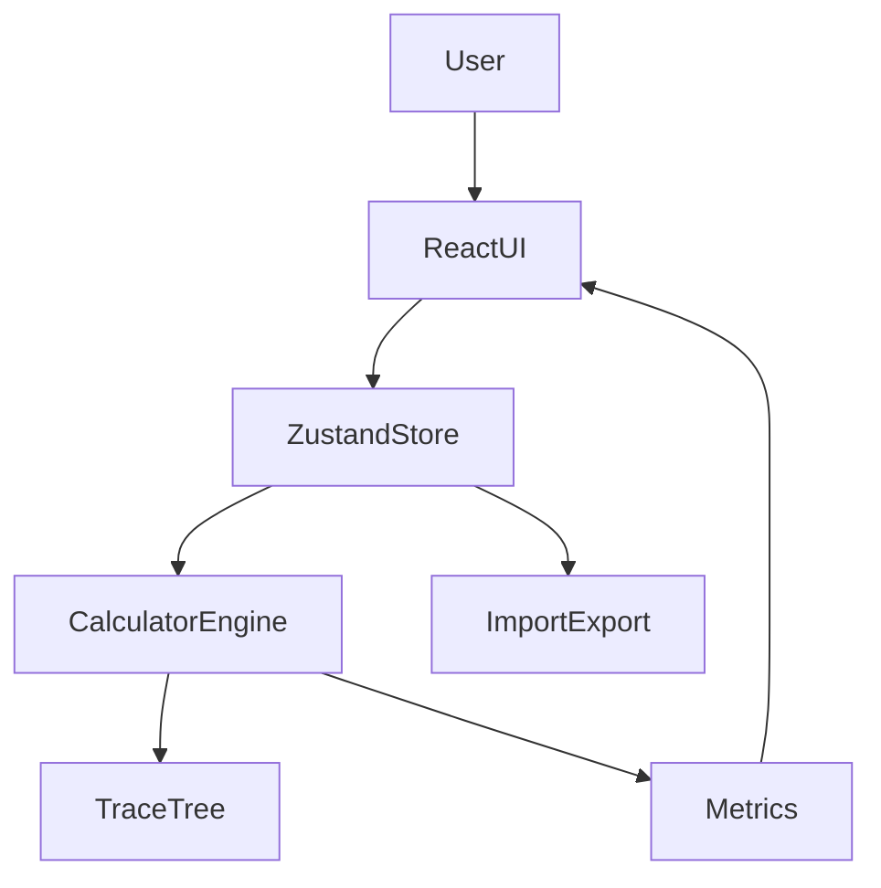

# 技术设计文档（Web / React）

## 总体架构

本项目是纯前端 SPA，核心分为三层：

- **UI 层**：表单、结果展示、追溯弹层、导入导出
- **状态层**：`zustand` + `persist`（localStorage）
- **计算层（engine）**：纯函数计算 + `TraceNode` 追溯结构

## 目录约定（`web/src`）

- `domain/types.ts`：领域类型（车、全局参数、假设、状态 schema）
- `engine/*`：计算与追溯
  - `calculator.ts`：落地价、牌照费用、能耗、贷款利息、机会成本、总成本、宝来基线
  - `scenarios.ts`：从枚举开关生成 `PlanVariant` 列表
  - `validate.ts`：一致性校验（例如充电占比合计）
  - `trace.ts`：追溯节点结构
  - `math.ts`：通用数学工具（月供等）
- `state/*`：默认数据、store、导入迁移
- `components/*`：页面区块与 UI 原语（Tailwind + Radix）
  - 结果区：`ResultsSection`（卡片/表格、成本与利息拆分、`SensitivityPanel`）
  - 追溯：`TraceTree` + Dialog；`fieldNav` 根据 `sources.path` 切换 Tab 并聚焦输入

## 关键数据结构

### `AppStateV1`

- `schemaVersion: 1`
- `cars: CarDraft[]`
- `globals: GlobalParams`
- `assumptions: Assumptions`
- `planGen: PlanGenerationOptions`

### `TraceNode`

追溯树节点包含：

- `label` / `unit` / `value`
- `formula?`：人类可读的公式说明
- `sources?`：指向输入路径（`input/global/assumption/constant`）
- `children?`：子节点

> UI 展示 `label + value + formula + children`；`input` / `global` / `assumption` 类型的 `sources` 已支持点击跳转对应 `data-field` 输入并短暂高亮。

## 计算模型（第一版）与已知简化

### 新车总成本（N年）

当前实现（见 `engine/calculator.ts`）使用可解释的简化模型：

\[
Total = Landing + Plate - BaoLaiRecovery + LoanInterest + Opportunity + Energy + Insurance + Maintenance - Residual
\]

重要说明：

- **贷款本金偿还**不计入费用；仅将**利息**计入（等额本息）。
- **首付机会成本**采用线性：`downPayment * annualRate * years`（与早期 spreadsheet 原型一致，便于理解；后续可改为复利折现）。
- **保险**：默认 `年均 = 首年 * factor`（factor 可配），可用车型字段覆盖。
- **维保**：默认 `年均 = 落地价 * rate`（rate 可配），可用车型字段覆盖。
- **PHEV 能耗**：按“用电里程占比”拆分为油段/电段；电价使用“加权电价”。
- **牌照**：仅计入参数化的牌照相关货币费用（竞价、迁移、绿牌、外地牌等）；**不包含**上牌等待、办理耗时或精力的货币化。

### 宝来基线（N年）

\[
Total = Fuel + Insurance + Maintenance + RepairReserve - Residual_{model}
\]

残值模型：`residual = residualIfSold * 0.85^years`（可在后续改为可配置折旧曲线）。

## 移动端交互设计

- **底部四段导航**：车型 / 全局 / 假设 / 结果（触控目标约 44px 高）
- **结果表格**：外层 `overflow-x-auto` + `min-w` 保证可读
- **追溯**：Radix Dialog，小屏全屏（`100dvh`），内容区可滚动

## 导入导出

### JSON

- 导出包含 `schemaVersion` 与核心字段，附加 `exportedAt` 元数据（不影响导入）
- 导入使用 `migrateToV1`：与默认值 deep merge，兼容未来字段扩展

### CSV

- 简化导出：方案、5年总成本、Δvs 宝来、月供

## 测试策略

- `vitest`：`engine/__tests__/calculator.test.ts`（落地价、新车/宝来追溯总值与合计一致）
- `vitest`：`engine/__tests__/scenarios.test.ts`（方案枚举与家庭蓝牌策略约束）
